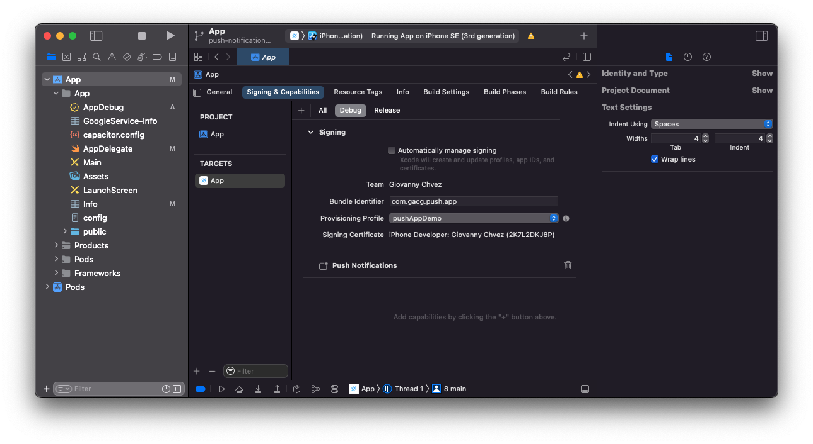

# push-app

## **A.** Ionic project

```Bash
appname=pushApp
bundle_id=com.gacg.push.app
```
```Bash
ionic start ${appname} --capacitor
cd ./${appname}
npm install @capacitor/cli @capacitor/core @capacitor/ios @capacitor/android
npm install @awesome-cordova-plugins/core cordova-plugin-device @awesome-cordova-plugins/device
npx cap init
```
```Bash
ionic build
```
```Bash
npx cap add ios && npx cap add android
```

#### Running on ionic CLI for live reload (testing)
```Bash
ionic capacitor run ios --l --external
```
```Bash
ionic capacitor run android --l --external
```
#### Running on Xcode / Android Studio 
```Bash
npx cap open ios
```
```Bash
npx cap open android
```


## **B.** Android

### Firebase
1. create Firebase project and add an android application.
2. register new app:
* download ```google-services.json``` and add to the project via ```/android/app/```.


## **C.** iOS

### Generate certificates
1. **create an account in Apple Developer Program**.
2. generate a *RSA* private key and *CSR* certificate:
```Bash
keyname=pushapp
work_path=/Users/giovannyceniceros/certificates/.pushApp/ios
```
```Bash
cd $work_path
openssl genrsa -out ${keyname}.key 2048
openssl req -new -key ${keyname}.key -out CertificateSigningRequest.certSigningRequest
```

3. login to [developer.apple.com](http://developer.apple.com/)
* go to ```Member Center → Certificates, IDs & Profiles → Identifiers``` and register a new identifier as *bundle_id*.
* go to ```Member Center → Certificates, IDs & Profiles → Devices``` and register a device. You must need the *UUID* device.
* go to ```Member Center → Certificates, IDs & Profiles → Certificates``` and generate a new certificate. Select *iOS App Development* and load the *CSR* file.
* go to ```Member Center → Certificates, IDs & Profiles → Keys``` and generate a new, check *Apple Push Notifications service (APNs)* box.
* go to ```Member Center → Certificates, IDs & Profiles → Profiles``` and generate a new provisional profile. download the ```.mobileprovision``` file.

4. signing certificate and generate secure private key copy ```.p12```.
```Bash
keyname=pushapp
work_path=/Users/giovannyceniceros/certificates/.pushApp/ios
```
```Bash
cd $work_path
openssl x509 -in ios_development.cer -inform DER -out ios_development.pem -outform PEM
openssl pkcs12 -export -inkey ${keyname}.key -in ios_development.pem -out ${keyname}.p12
```

5. signing certificate with **keychain** tool:
* adding both ```.p12``` and ```.cer``` files to **keychain** tool:
<p align="center">
  
</p>

6. put certificates on xcode project

<p align="center">
  
</p>


### Firebase

1. create Firebase project and add an ios application.
2. register new app:
* download ```GoogleService-Info.plist``` and add to the project via **XCode**.

<p align="center">
  
</p>

<p align="center">
  
</p>

* add Firebase dependencies on *Cocoapods* project by ```Podfile```. Check [available libraries.](https://firebase.google.com/docs/cpp/setup?platform=ios&authuser=0&hl=es#add-config-file)

```Ruby
pod 'Firebase/Messaging'
```
```Podfile``` must looks like this:

```Ruby
target 'App' do
  capacitor_pods
    # Add your Pods here
    # Add the pods for the Firebase products you want to use in your app
    # For example, to use Firebase Authentication and Cloud Firestore
    pod 'Firebase/Messaging'
end
```

* update project by
```
npx cap update ios
```
(or update *Cocoapods* project by ```pod install --repo-update``` on ```ios/App``` path).
* add Firebase code on ```AppDelegate.swift``` file:


```Swift
import Firebase
```

```Swift
FirebaseApp.configure()
```

```Swift
func application(_ application: UIApplication, didRegisterForRemoteNotificationsWithDeviceToken deviceToken: Data) {
    Messaging.messaging().apnsToken = deviceToken
    Messaging.messaging().token(completion: { (token, error) in
        if let error = error {
            NotificationCenter.default.post(name: .capacitorDidFailToRegisterForRemoteNotifications, object: error)
        } else if let token = token {
            NotificationCenter.default.post(name: .capacitorDidRegisterForRemoteNotifications, object: token)
        }
    })
}

func application(_ application: UIApplication, didFailToRegisterForRemoteNotificationsWithError error: Error) {
    NotificationCenter.default.post(name: .capacitorDidFailToRegisterForRemoteNotifications, object: error)
}
```

```AppDelegate.swift``` file must looks like this:

```Swift
import UIKit
import Capacitor
import Firebase // (1)

@UIApplicationMain
class AppDelegate: UIResponder, UIApplicationDelegate {

    var window: UIWindow?

    func application(_ application: UIApplication, didFinishLaunchingWithOptions launchOptions: [UIApplication.LaunchOptionsKey: Any]?) -> Bool {
        FirebaseApp.configure() // (2)
        return true
    }
    /**
     *   (3A)
     */
    func application(_ application: UIApplication, didRegisterForRemoteNotificationsWithDeviceToken deviceToken: Data) {
        Messaging.messaging().apnsToken = deviceToken
        Messaging.messaging().token(completion: { (token, error) in
            if let error = error {
                NotificationCenter.default.post(name: .capacitorDidFailToRegisterForRemoteNotifications, object: error)
            } else if let token = token {
                NotificationCenter.default.post(name: .capacitorDidRegisterForRemoteNotifications, object: token)
            }
        })
    }
    /**
     *   (3B)
     */
    func application(_ application: UIApplication, didFailToRegisterForRemoteNotificationsWithError error: Error) {
        NotificationCenter.default.post(name: .capacitorDidFailToRegisterForRemoteNotifications, object: error)
    }
}
```

## **D.** Push notification service
```Bash
ionic g service services/fcm
ionic g page pages/details
```

on ```src/app/app.module.ts```:

```Typescript
import { Device } from '@awesome-cordova-plugins/device/ngx';

@NgModule({
  declarations: [AppComponent],
  entryComponents: [],
  imports: [BrowserModule, IonicModule.forRoot(), AppRoutingModule],
  providers: [{ provide: RouteReuseStrategy, useClass: IonicRouteStrategy }, Device],
  bootstrap: [AppComponent],
})
export class AppModule {}
```


on ```src/app/services/fcm.service.ts```:

```Typescript
import {
  ActionPerformed,
  PushNotificationSchema,
  PushNotifications,
  Token,
} from '@capacitor/push-notifications';
import { Device } from '@awesome-cordova-plugins/device/ngx';

@Injectable({
  providedIn: 'root'
})
export class FcmService {

  constructor() { }

  public init() {
    if (Capacitor.getPlatform() !== "web") {
      this.register();
    }
  }

  private register() {
    PushNotifications.requestPermissions().then(permission => {
      if (permission.receive === 'granted') {
        PushNotifications.register();
      } else {
        console.log("Push notifications doesn't work");
      }
    });

    /**
     * On success, we should be able to receive notifications
     */
    PushNotifications.addListener('registration',
      (token: Token) => {
        console.log("SUCCESS! TOKEN: " + token.value + " UUID: " + this.device.uuid);
      }
    );

    /**
     * Some issue with our setup and push will not work
     */
    PushNotifications.addListener('registrationError',
      (error: any) => {
        console.log('Error on registration: ' + JSON.stringify(error));
      }
    );

    /**
     * Show us the notification payload if the app is open on our device
     */
    PushNotifications.addListener('pushNotificationReceived',
      (notification: PushNotificationSchema) => {
        console.log('Push received: ' + JSON.stringify(notification));
      }
    );
  }
}
```